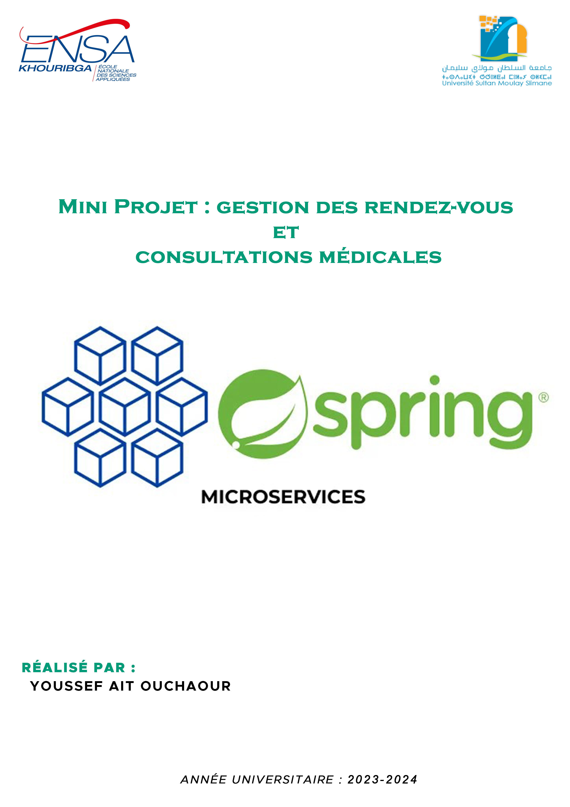

<br><br>

# Introduction
&nbsp;&nbsp;&nbsp;Ce rapport présente un mini-projet de gestion des rendez-vous et consultations médicales, développé avec une architecture microservices utilisant Spring Boot. L'objectif est d'optimiser la gestion des rendez-vous médicaux en adoptant une approche modulaire et scalable. Nous explorons le processus de conception, d'implémentation et de déploiement, mettant en avant les avantages de l'architecture microservices dans ce contexte spécifique. Ce rapport offre un aperçu des choix technologiques, des défis rencontrés et des perspectives d'amélioration continue. L'approche choisie vise à moderniser et à rendre plus efficace la gestion des rendez-vous médicaux.

# Objectifs

L'objectif principal de ce projet est de concevoir et de mettre en œuvre une application modulaire et évolutive pour la gestion des rendez-vous et consultations médicales.

- Développer deux services distincts, le premier pour gérer les informations des patients et des médecins, et le deuxième pour gérer les rendez-vous et les consultations.
<br>
- Assurer l'intégration et la communication efficace entre les services à l'aide de l'API Gateway et des clients REST.

- Utiliser un registre de services pour la découverte et l'enregistrement des services.

- Mettre en place un serveur de configuration pour la gestion centralisée des configurations de services.

- Garantir la sécurité, la fiabilité et la disponibilité de l'application.


# Table of Content
- [Introduction](#introduction)
- [Objectifs](#objectifs)
- [Table of Content](#table-of-content)
- [Conception & Architecture](#conception--architecture)
- [Contenu application](#contenu-application)
  - [First-Service (Medecin-Patient)](#ifirst-service)
  - [Second-Service (Rendezvous-Consultation)](#iisecond-service)
  - [Gateway-Service](#iiigateway-service)
  - [Discovery-Service](#ivdiscovery-service)
  - [Config-Service](#vconfig-service)
- [Documentation des Tests avec Swagger UI](#documentation-des-tests-avec-swagger-ui)
- [Conclusion](#conclusion)

<br><br><br>

# Conception & Architecture

- __Diagramme de classes :__

    

    Le diagramme montre quatre entités principales : **Patient**, **Medecin**, **RendezVous**, et **Consultation**. Les Patients peuvent avoir plusieurs RendezVous, chaque RendezVous est pour un Patient et un Medecin spécifique, et à chaque RendezVous correspond une Consultation unique.

- __Architecture Microservices :__

    

    L'application reçoit des requêtes HTTP d'une partie cliente qui interagit avec le système via une API Gateway. Le système est divisé en deux services principaux : le premier service gère les médecins et les patients, et le deuxième service gère les rendez-vous et les consultations. Chaque service interagit avec sa propre base de données.

    Il existe également des composants de support tels que la configuration centralisée (Config Server) et l'enregistrement des services (Service Registry ou Discovery Service). Cela indique une structure conçue pour la résilience, la scalabilité et la gestion efficace des configurations et des services dans un environnement de microservices.

    
    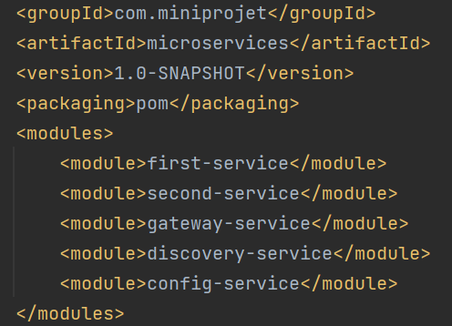

voici les services de projet, sachant que:

**first service** : Service de Gestion des Patients et Médecins.

**second service** : Service de Gestion des Rendez-vous et Consultations.

- __Technologies Utilisées :__

    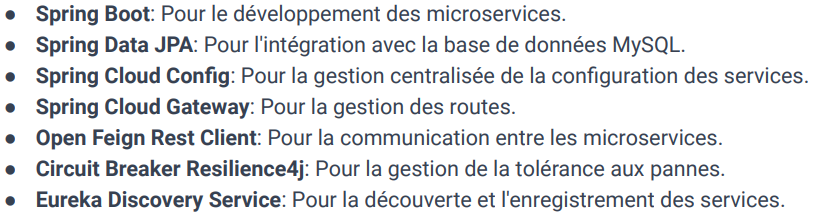
<br>

# Contenu application

## <span style="color:green;font-weight: bold;">I.First Service : </span>


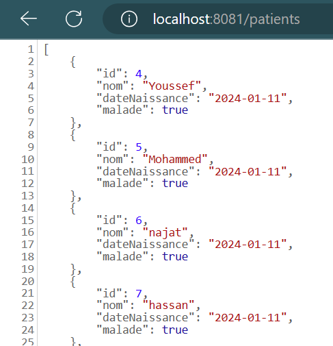 


- Entities: 
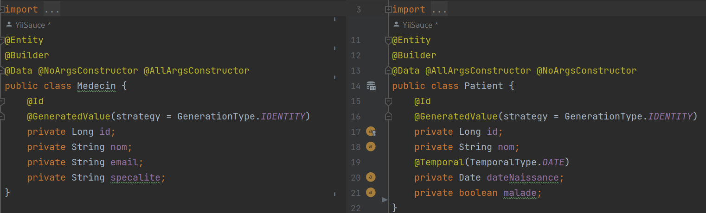

- Repository:
    ```java
    package com.miniprojet.firstservice.repositories;
    //MedecinRepository
    @RepositoryRestResource
    public interface MedecinRepository extends JpaRepository<Medecin, Long> {
        Medecin findByNom(String nom);
    }
    ```
    ```java
    package com.miniprojet.firstservice.repositories;
    //PatientRepository
    @RepositoryRestResource
    public interface PatientRepository extends JpaRepository<Patient, Long> {
        Patient findByNom(String nom);
    }
    ```
- Services:
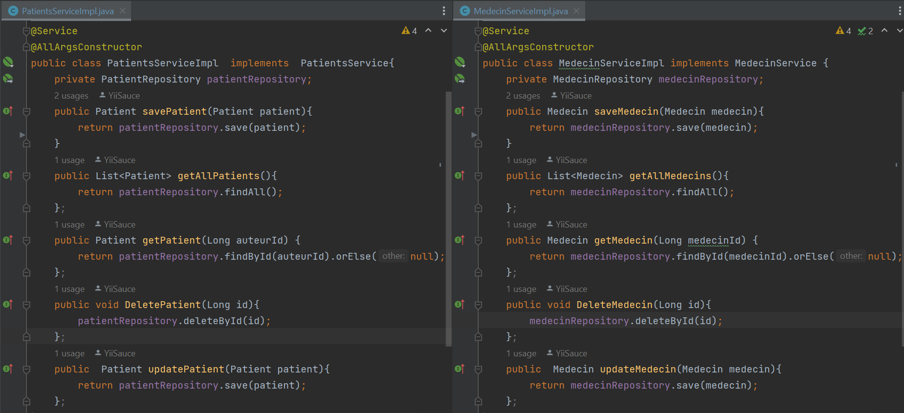

    ```java
    public interface PatientsService {
        Patient savePatient(Patient patient);
        public List<Patient> getAllPatients();
        public Patient getPatient(Long auteurId);
        public void DeletePatient(Long id);
        public  Patient updatePatient(Patient patient);
    }
    ```
    ```java
    public interface MedecinService {
        Medecin saveMedecin(Medecin medecin);
        public List<Medecin> getAllMedecins();
        public Medecin getMedecin(Long auteurId);
        public void DeleteMedecin(Long id);
        public  Medecin updateMedecin(Medecin medecin);
    }
    ```
- Web:
    ```java
    //Medecin Controller
    @RestController
    public class MedecinController {
        @Autowired
        private MedecinService medecinService;
        @GetMapping(path = "medecins")
        public List<Medecin> getMedecins(){
            return medecinService.getAllMedecins();
        }
        @GetMapping("medecins/{medecinId}")
        public  Medecin getMedecinById(@PathVariable Long medecinId){
            return medecinService.getMedecin(medecinId);
        }
        @DeleteMapping("medecins/{medecinId}")
        public void deleteMedecin(@PathVariable  Long medecinId){
            medecinService.DeleteMedecin(medecinId);
        }
        @PostMapping("/medecins")
        public Medecin saveMedecin(@RequestBody Medecin medecin){
            return medecinService.saveMedecin(medecin);
        }
        @PutMapping("medecins/{medecinId}")
        public  Medecin updateMedecin(@RequestBody Medecin medecin) {
            return medecinService.updateMedecin(medecin);
        }
    }
    ```
    ```java
    //Patient Controller
    @RestController
    public class PatientController {
        @Autowired
        private PatientsService patientsService;
        @GetMapping(path = "patients")
        public List<Patient> getPatients(){
            return patientsService.getAllPatients();
        }
        @GetMapping("patients/{patientId}")
        public  Patient getPatientById(@PathVariable Long patientId){
            return patientsService.getPatient(patientId);
        }
        @DeleteMapping("patients/{patientId}")
        public void deletePatient(@PathVariable  Long patientId){
            patientsService.DeletePatient(patientId);
        }
        @PostMapping("/patients")
        public Patient savePatient(@RequestBody Patient patient){
            return patientsService.savePatient(patient);
        }
        @PutMapping("patients/{patientId}")
        public Patient updatePatient( @PathVariable Long patientId, @RequestBody Patient patient) {
            return patientsService.updatePatient(patient);
        }
    }
    ```

- application.properties:
    ```java
    spring.application.name=first-service
    server.port=8081
    spring.config.import=optional:configserver:http://localhost:9999/}
    ```
    Pour importer la configuration à partir du serveur de configuration situé à http://localhost:9999/. Le si le serveur de configuration n'est pas disponible ou ne peut pas être contacté, l'application ne s'arrêtera pas ou ne renverra pas d'erreur.

## <span style="color:green;font-weight: bold;">II.Second Service :</span>


- Entities:
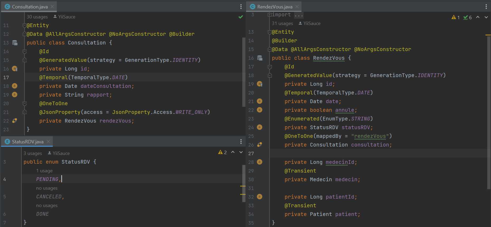
- Repository:
    ```java
    //Consultation Repository
    @RepositoryRestResource
    public interface ConsultationRepository extends JpaRepository<Consultation, Long> {
    }
    ```
    ```java
    //Rendez-vous Repository
    @RepositoryRestResource
    public interface RendezvousRepository extends JpaRepository<RendezVous,Long> {
    }
    ```

- Model:

    le package model contient toutes les classes dont nous aurons besoin dans le 2ème service à partir du 1er service (**ce ne sont pas des entités JPA**).

    

- Client:


    ```java
    @FeignClient(name = "FIRST-SERVICE")
    public interface FirstServiceRestClient {
        @GetMapping("/patients/{id}")
        public Patient getPatientById(@PathVariable Long id);
        @GetMapping("/patients")
        public List<Patient> getPatients();
        @GetMapping("/medecins/{id}")
        public Medecin getMedecinById(@PathVariable Long id);
        @GetMapping("/medecins")
        public List<Medecin> getMedecins();
    }
    ```
    **FirstServiceRestClient** : est un client **Feign** utilisé pour interagir avec un service distant. Elle appartient au deuxième service (SECOND-SERVICE) et communique avec le premier service (FIRST-SERVICE). Les méthodes définies dans cette interface correspondent aux points de terminaison du premier service pour récupérer des informations sur les patients et les médecins.

    ><span style="color:green"> @FeignClient</span>(name = "FIRST-SERVICE") : Spécifie que cette interface est un client Feign pour le service nommé "FIRST-SERVICE".

- Services:

    on retrouve ici toutes les fonctionnalités **CRUD** pour créer, supprimer mettre à jour et manipuler toutes les entités de notre service.

    ```java
    @Service
    public  class RendezvousServiceImpl  implements RendezvousService{
        @Autowired
        private RendezvousRepository rendezvousRepository;
        @Autowired
        private ConsultationRepository consultationRepository;
        @Autowired
        private FirstServiceRestClient firstServiceRestClient;
        @Override
        public RendezVous saveRendezVous(RendezVous rendezVous){
            Medecin medecin = firstServiceRestClient.getMedecinById(rendezVous.getMedecinId());
            Patient patient = firstServiceRestClient.getPatientById(rendezVous.getPatientId());
            if(medecin!=null && patient!=null){
            rendezVous.setMedecin(medecin);
            rendezVous.setPatient(patient);
            return rendezvousRepository.save(rendezVous);
            }
            return null;
        }
        @Override
        public List<RendezVous> getAllRendezVous(){return rendezvousRepository.findAll();}
        @Override
        public RendezVous getRendezVous(Long rendezvousId) {
            RendezVous rendezVous = rendezvousRepository.findById(rendezvousId).orElse(null);
            Medecin medecin = firstServiceRestClient.getMedecinById(rendezVous.getMedecinId());
            Patient patient = firstServiceRestClient.getPatientById(rendezVous.getPatientId());
            rendezVous.setMedecin(medecin);
            rendezVous.setPatient(patient);
            return rendezVous;
        };
        @Override
        public void deleteRendezVous(Long id){
            RendezVous rendezVous = rendezvousRepository.findById(id).orElse(null);
            if (rendezVous != null) {
                Consultation consultation = rendezVous.getConsultation();
                if (consultation != null) {
                    consultationRepository.deleteById(consultation.getId());
                }
                rendezvousRepository.deleteById(id);
            }
        };
        @Override
        public  RendezVous updateRendezVous(RendezVous rendezVous){
            RendezVous rv = getRendezVous(rendezVous.getId());
            rv.setStatusRDV(rendezVous.getStatusRDV());
            rv.setDate(rendezVous.getDate());
            rv.setAnnule(rendezVous.isAnnule());
            rv.setConsultation(rendezVous.getConsultation());
            rv.setPatientId(rendezVous.getPatientId());
            rv.setMedecinId(rendezVous.getMedecinId());
            Medecin medecin = firstServiceRestClient.getMedecinById(rendezVous.getMedecinId());
            Patient patient = firstServiceRestClient.getPatientById(rendezVous.getPatientId());
            rv.setMedecin(medecin);
            rv.setPatient(patient);
            return rendezvousRepository.save(rv);
        };
    }
    ```
    pour casser la relation entre FIRST-SERVICE et SECOND-SERVICE (OneToMany), nous obtenons les models dont nous avons besoin en utilisant le firstservicerestclient et les intégrons dans le notre service

    ```java
    @Service
    public class ConsultationServiceImpl implements  ConsultationService{
        @Autowired
        private ConsultationRepository consultationRepository;
        public Consultation saveConsultation(Consultation consultation){return consultationRepository.save(consultation);};
        public List<Consultation> getAllConsultations(){
            return consultationRepository.findAll();
        };
        public Consultation getConsultation(Long consultationId){
            return  consultationRepository.findById(consultationId).orElse(null);
        };
        public void DeleteConsultation(Long id){
            consultationRepository.deleteById(id);
        };
        public  Consultation updateConsultation(Consultation consultation){
            Consultation consultation1 = getConsultation(consultation.getId());
            consultation1.setDateConsultation(consultation.getDateConsultation());
            consultation1.setRapport(consultation.getRapport());
            return consultationRepository.save(consultation1);
        };
    }
    ```
- Web:
    ```java
    @RestController
    public class RendezvousController {
        @Autowired
        private RendezvousService rendezvousService;
        //READ
        @GetMapping(path = "rendezVous")
        public List<RendezVous> getRendezVous(){
            return rendezvousService.getAllRendezVous();
        }
        //READ BY ID
        @GetMapping("rendezVous/{rendezVousId}")
        public RendezVous getRendezvousById(@PathVariable Long rendezVousId){return rendezvousService.getRendezVous(rendezVousId);}
        //DELETE
        @DeleteMapping("rendezVous/{rendezVousId}")
        public void deleteRendezVous(@PathVariable  Long rendezVousId){rendezvousService.deleteRendezVous(rendezVousId);}
        //CREATE
        @PostMapping("rendezVous")
        public RendezVous saveRendezVous(@RequestBody RendezVous rendezVous){return rendezvousService.saveRendezVous(rendezVous);}
        //UPDATE
        @PutMapping("rendezVous/{rendezVousId}")
        public  RendezVous updateRendezvous(@RequestBody RendezVous rendezVous) {return rendezvousService.updateRendezVous(rendezVous);}
    }
    ```
    ```java
    @RestController
    public class ConsultationController {
        @Autowired
        private ConsultationService consultationService;
        @GetMapping(path = "consultations")
        public List<Consultation> getConsultations(){return consultationService.getAllConsultations();}
        @GetMapping("consultations/{consultationId}")
        public Consultation getConsultationById(@PathVariable Long consultationId){
            return consultationService.getConsultation(consultationId);
        }
        @DeleteMapping("consultations/{consultationId}")
        public void deleteConsultation(@PathVariable  Long consultationId){
            consultationService.DeleteConsultation(consultationId);
        }
        @PostMapping("consultations")
        public Consultation saveConsultation(@RequestBody Consultation consultation){
            return consultationService.saveConsultation(consultation);
        }
        @PutMapping("consultations/{consultationId}")
        public  Consultation updateConsultation(@RequestBody Consultation consultation) {
            return consultationService.updateConsultation(consultation);
        }
    }
    ```
- application.properties:
    ```java
    spring.application.name=second-service
    server.port=8082
    spring.config.import=optional:configserver:http://localhost:9999/}
    feign.client.config.default.loggerLevel=full
    ```

> <span style="color:red"> **Note:** </span>
> nous devons ajouter ces annotations à la classe SecondServiceApplication: **@EnableDiscoveryClient @EnableFeignClients**

## <span style="color:green;font-weight: bold;">III.Gateway Service :</span>  
Le service Gateway agit comme un intermédiaire qui simplifie la complexité des interactions entre le client et les microservices.
- GatewayServiceApplication:
    ```java
    @SpringBootApplication
    public class GatewayServiceApplication {
        public static void main(String[] args) {
            SpringApplication.run(GatewayServiceApplication.class, args);
        }
        @Bean
        DiscoveryClientRouteDefinitionLocator dynamicRoutes(ReactiveDiscoveryClient rdc,DiscoveryLocatorProperties dlp){
            return new DiscoveryClientRouteDefinitionLocator(rdc,dlp);
        }
    }
    ```
- application.properties:
    ```java
    spring.application.name=gateway-service
    server.port=8888
    spring.config.import=optional:configserver:http://localhost:9999/
    ```
- application.yml:
    ```yaml
    spring:
    cloud:
        gateway:
        routes:
            - id: r1
            uri: http://localhost:8081/
            predicates:
                - Path=/medecins/**
            - id: r2
            uri: http://localhost:8082/
            predicates:
                - Path=/rendezVous/**
    application:
        name: gateway-service
    server:
    port: 8888
    ```
    
Ce fichier .yml est une configuration pour le Gateway Service Il définit des règles de routage pour le service passerelle (API Gateway).

## <span style="color:green;font-weight: bold;">IV.Discovery Service :</span>

Les microservices interrogent le Discovery Service pour trouver les instances disponibles d'autres services auxquels ils souhaitent faire appel. Cela facilite la communication dynamique et l'équilibrage de charge entre les services, et pour une meilleure tolérance aux pannes. Les outils populaires pour le service de découverte incluent Eureka de Netflix que nous utilisons dans notre application.

- DiscoveryServiceApplication:
    ```java
    @SpringBootApplication
    @EnableEurekaServer
    public class DiscoveryServiceApplication {
        public static void main(String[] args) {
            SpringApplication.run(DiscoveryServiceApplication.class, args);
        }
    }
    ```
- application.properties:
    ```java
    spring.application.name=discovery-service
    server.port=8761
    #dont register server itself as client
    eureka.client.fetch-registry=false
    # does not register itself in the service registry
    eureka.client.register-with-eureka=false
    ```
    voici le server d'Eureka:
    
    

> <span style="color:green">@EnableEurekaServer</span> : pour activer la fonctionnalité du serveur Eureka dans une application Spring Boot. Lorsqu'elle est appliquée à la classe principale d'un projet Spring Boot, elle indique que l'application agira en tant que serveur Eureka.

## <span style="color:green;font-weight: bold;">V.Config Service :</span>
- ConfigServiceApplication:
    ```java
    @SpringBootApplication
    @EnableConfigServer
    public class ConfigServiceApplication {
        public static void main(String[] args) {
            SpringApplication.run(ConfigServiceApplication.class, args);
        }
    }
    ```
- application.properties:
    ```java
    spring.application.name=config-service
    server.port=9999
    #spring.cloud.config.server.git.uri=file://${user.home}/config
    spring.cloud.discovery.enabled=true
    #spring.cloud.config.server.git.default-label=master
    spring.cloud.config.server.git.uri=file:///C:/Users/RPC/Desktop/Mini-Projet/microservices/config
    ```
- config(dossier):
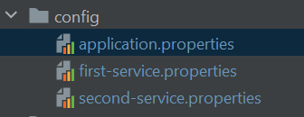  

    pour fournir un support de configuration centralisé et externe aux applications, nous mettons le fichier de configuration de chaque service(configurations de base de données...) dans le répertoire de **config**.

    | service | properties |
    | ----------- | ----------- |
    | first-service |  |
    | second-service | 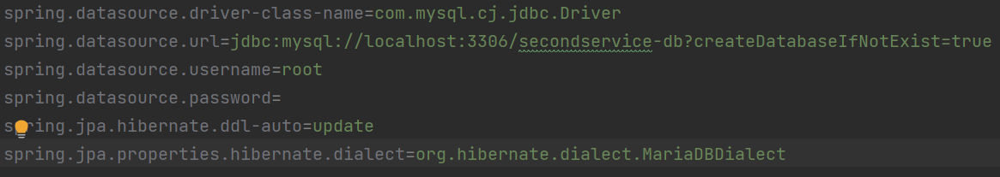 |
    | application.properties | 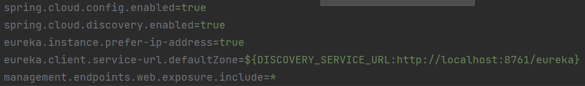 |

<br>

# Documentation des Tests avec Swagger UI

avant d'exécuter tous les services pour tester les API et leurs méthodes, nous ajoutons le package d'openAPI au pom.xml du chaque service (first-service & second-service) afin d'obtenir une interface UI:
```xml
<dependency>
    <groupId>org.springdoc</groupId>
    <artifactId>springdoc-openapi-starter-webmvc-ui</artifactId>
    <version>2.3.0</version>
</dependency>
<dependency>
    <groupId>org.springframework.boot</groupId>
    <artifactId>spring-boot-starter-validation</artifactId>
    <version>3.2.1</version>
</dependency>
```

> <span style="color:red"> **Note:** </span>
> nous avons ajouté quelques données dans les deux services pour tester et visualiser.


<br>

## 1. Service de Gestion des Patients et Médecins: 

Nous pouvons accéder à l'API en utilisant cette URL (depuis le Gateway) : 

- __Patient :__

    

    #### *Afficher tous les patients*
    

    #### *Ajouter un patient*
    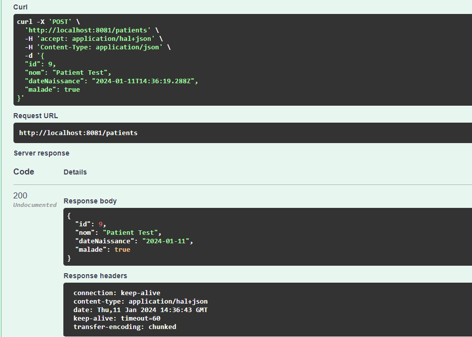

    #### *Afficher un patient par son identifiant*
    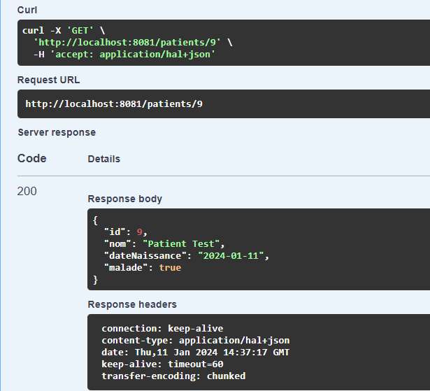

    #### *Mettre à jour un patient*
    

    #### *Supprimer un patient*
    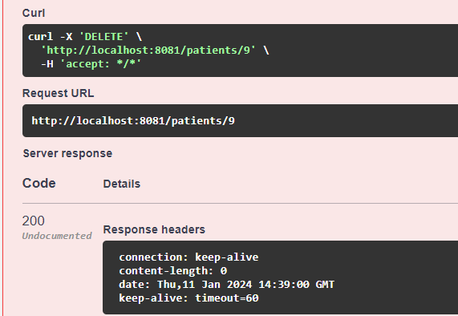

- __Medecin :__

    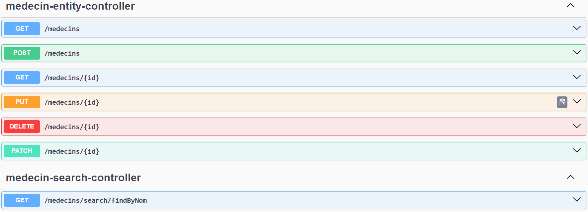

    #### *Afficher tous les medecins*
    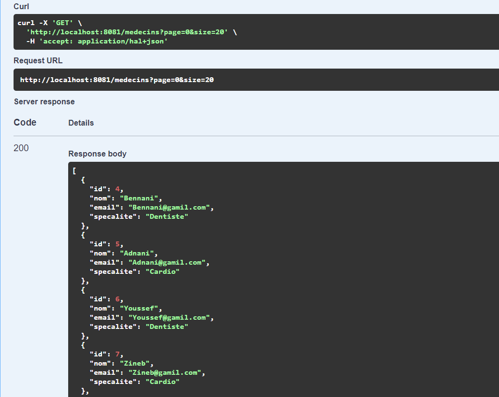

    #### *Ajouter un medecin*
    

    #### *Afficher un medecin par son identifiant*
    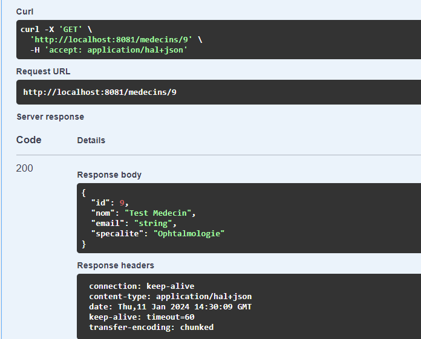

    #### *Mettre à jour un medecin*
    

    #### *Supprimer un medecin*
    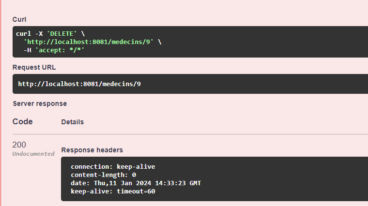

    #### *Afficher un Medecin par son nom*
    

<br>

## 2. Service de Gestion des Rendez-vous et Consultations: 

Nous pouvons accéder à l'API en utilisant cette URL (depuis le Gateway) : 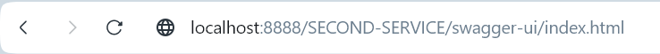

- __RendezVous :__

    

    #### *Afficher tous les rendezVous*
    

    #### *Ajouter un rendezVous*
    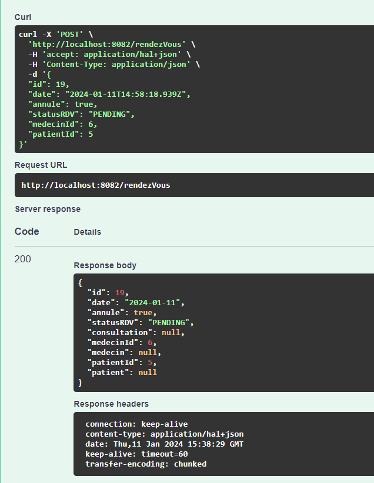

    #### *Afficher un rendezVous par son identifiant*
    

    #### *Mettre à jour un rendezVous*
    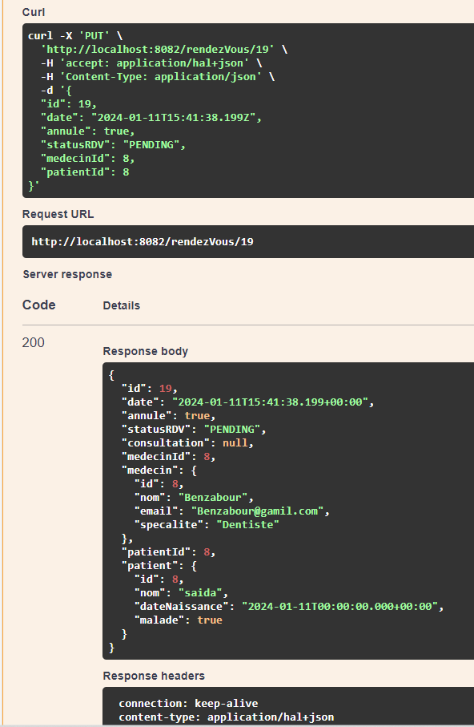

    #### *Supprimer un rendezVous*
    

- __Consultation :__

    

    #### *Afficher tous les consultations*
    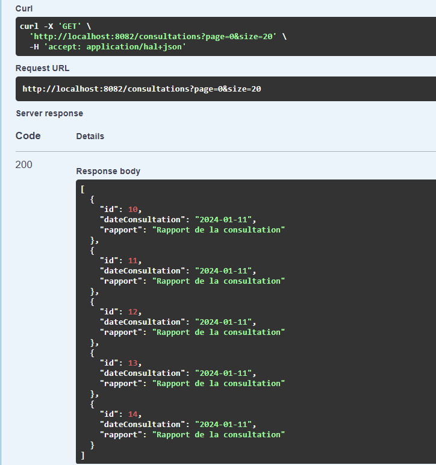

    #### *Ajouter une consultation*
    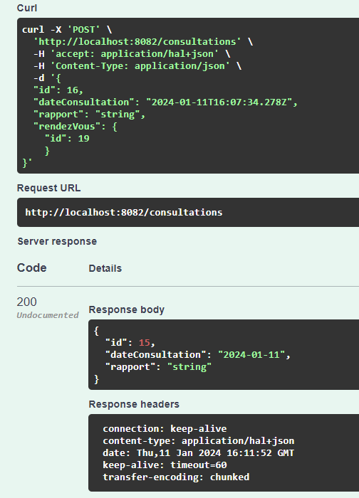

    #### *Afficher une consultation par son identifiant*
    

    #### *Mettre à jour une consultation*
    

    #### *Supprimer une consultation*
    

<br>

## Conclusion

L'approche microservices adoptée pour la conception de l'application de gestion des rendez-vous et consultations médicales a démontré une amélioration significative de la modularité et de la scalabilité du système. Grâce à la séparation des préoccupations, chaque service peut être développé, déployé et mis à jour indépendamment, permettant une maintenance et une évolution plus aisées de l'application. L'utilisation d'une API Gateway a simplifié l'interaction entre les clients et les services, tandis que l'intégration du registre de services et du serveur de configuration a renforcé la cohérence et la fiabilité de la configuration.

 >vous pouvez trouver le code source du projet dans mon github : [Microservices-Mini-Projet](https://github.com/YiiSauce/Microservices-Mini-Projet/tree/monolith/microservices)
