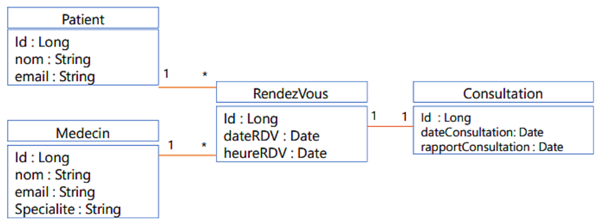
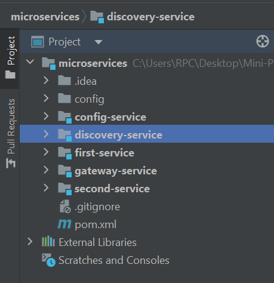

<div style="display:flex;justify-content:space-between">
    <div>
        <strong>
            Realise par :
        </strong>  
        <br>&nbsp;&nbsp;&nbsp;&nbsp;Omar Lahbabi 
        <br>&nbsp;&nbsp;&nbsp;&nbsp;Ilyas Belarbi 
    </div>
    <div>
        2023-2024
    </div>
    <div>
            
        </div>
</div>
<br>
<div>
    <strong>
        Filliere :
    </strong>  IID2
</div>
<div style = "text-align:center">
    <strong>
        Encadre par : 
    </strong>Mme Karroum Bouchra
</div>
<br>
<div style="font-size:35px;font-weight:bold;text-align:center;">
    Rapport Projet Java/JEE
</div>
<br>
<div style = "color:#66c2ff;text-align:center">
Location des voitures
</div>
<br>

# Introduction
&nbsp;&nbsp;&nbsp;La gestion efficace des déplacements est un enjeu crucial pour de nombreuses personnes, qu'elles soient en voyage d'affaires, en vacances, ou simplement en besoin d'un moyen de transport temporaire. Trouver une voiture adaptée, à un prix abordable et dans des délais courts peut souvent se révéler être un défi, surtout dans les grandes agglomérations ou les destinations touristiques très fréquentées.

C'est dans ce contexte que __CarsForRent__, notre application de location de voiture, devient un outil indispensable. Elle offre une solution pratique et centralisée pour trouver et réserver le véhicule idéal en quelques clics. Grâce à [Nom de l'App], les utilisateurs ont accès à une large gamme de voitures, adaptées à toutes les exigences et budgets, simplifiant ainsi la planification des déplacements et assurant une expérience de location fluide et sans tracas.

# Objectifs

- __Espace Personnel :__
  - Gestion des profils utilisateur et des réservations.
  - Connexion des personnels de l’agence.

  - Génération de factures et de reçus pour les transactions.
<br>
- __Espace Client :__
  - Inscription et connexion des clients.
  
  - Recherche de voitures disponibles selon la date, la marque.
  - Réservation de voitures avec options de paiement en ligne.


# Table of Content
- [Introduction](#introduction)
- [Objectifs](#objectifs)
- [Table of Content](#table-of-content)
- [Conception & Architecture](#conception)
- [Contenu application(Code Source)](#contenu-application)
  - [Config-Service](#config)
  - [Discovery-Service](#discovery)
  - [Gateway-Service](#gateway)
  - [First-Service (Medecin-Patient)](#first)
  - [Second-Service (Rendezvous-Consultation)](#second)
- [Documentation des Tests avec Swagger UI](#documentation)
- [Conclusion](#conclusion)


# Conception De System Informatique


- __Diagramme de classes :__



Le diagramme montre quatre entités principales : **Patient**, **Medecin**, **RendezVous**, et **Consultation**. Les Patients peuvent avoir plusieurs RendezVous, chaque RendezVous est pour un Patient et un Medecin spécifique, et à chaque RendezVous correspond une Consultation unique.

- __Architecture Microservices :__


L'application reçoit des requêtes HTTP d'une partie cliente qui interagit avec le système via une API Gateway. Le système est divisé en deux services principaux : le premier service gère les médecins et les patients, et le deuxième service gère les rendez-vous et les consultations. Chaque service interagit avec sa propre base de données.

Il existe également des composants de support tels que la configuration centralisée (Config Server) et l'enregistrement des services (Service Registry ou Discovery Service). Cela indique une structure conçue pour la résilience, la scalabilité et la gestion efficace des configurations et des services dans un environnement de microservices.




voici les services de projet

<!-- - Client:
```sql
CREATE TABLE Client (
    id_client SERIAL PRIMARY KEY,
    Nom VARCHAR(255),
    Prenom VARCHAR(255),
    Email VARCHAR(255),
    password VARCHAR(255)
);
```
- Paiement:
```sql
CREATE TABLE Paiment (
    id_paie SERIAL PRIMARY KEY,
    id_res INT,
    montant FLOAT,
    datePaiement DATE,
    moyen VARCHAR(255),
    id_fact INT,
    FOREIGN KEY (id_res) REFERENCES Reservation(id_res),
    FOREIGN KEY (id_fact) REFERENCES Facture(id_fact)
);
```
- Facture:
```sql
CREATE TABLE Facture (
    id_fact SERIAL PRIMARY KEY,
    attribute3 VARCHAR(255),
    attribute4 VARCHAR(255),
    id_res INT,
    FOREIGN KEY (id_res) REFERENCES Reservation(id_res)
);
```
- Reservation:
```sql
CREATE TABLE Reservation (
    id_res SERIAL PRIMARY KEY,
    id_client INT,
    id_car BIGINT,
    id_pers INT, -- Ajout de la colonne pour référencer Personnel
    dateDebut DATE,
    dateFin DATE,
    prix FLOAT,
    FOREIGN KEY (id_client) REFERENCES Client(id_client),
    FOREIGN KEY (id_car) REFERENCES voiture(id),
    FOREIGN KEY (id_pers) REFERENCES Personnel(id_pers) -- Nouvelle clé étrangère
);
```
- Personnel:
```sql
CREATE TABLE Personnel (
    id_pers SERIAL PRIMARY KEY,
    Nom VARCHAR(255),
    Prenom VARCHAR(255),
    Email VARCHAR(255),
    password VARCHAR(255)
);
```
- Voiture:
```sql
CREATE TABLE voiture (
    id SERIAL PRIMARY KEY,
    make VARCHAR(255),
    model VARCHAR(255),
    price NUMERIC,
    year INTEGER,
    kilometer NUMERIC,
    fuel_type VARCHAR(50),
    transmission VARCHAR(50),
    location VARCHAR(255),
    color VARCHAR(50),
    owner VARCHAR(255),
    seller_type VARCHAR(50),
    engine VARCHAR(50),
    max_power VARCHAR(50),
    max_torque VARCHAR(50),
    drivetrain VARCHAR(50),
    length NUMERIC,
    width NUMERIC,
    height NUMERIC,
    seating NUMERIC,
    fuel_tank_capacity NUMERIC
);
``` -->

# Contenu application

Pour notre application, il est subdiviser en 3 interfaces :
- welcome Interface
- Client Interface
- Personnel Interface

## Welcome interface

Une interface d'accueil efficace pour une application de location de voiture devrait allier esthétique, fonctionnalité et facilité d'utilisation. Voici une description détaillée d'une telle interface :
- Barre de Navigation en Haut
- Carrousel d'Images et Offres Spéciales
- Informations Utiles et Conseils
- Section Avis des Utilisateurs
- Pied de Page


- Section recherche des voitures


## Login Interface 

La Deuxieme interface est un formulare Login lie a un formulaire d'inscription qui consiste d'une zone de text et motdepasse avec un button __Sign In__.
On peut voir que le click sur le button __Sign In__ declanche le processus de login, dont on fetch l'email et le mot de passe entre par l'utilisateur et compare leurs (email, password) pair avec les valeurs entrees par l'utilisateur.


Apres connexion, le client a le droit de reserver des voitures entre 2 dates differentes


Si la reservation est approuvee par un admin, elles seront affiches dans la categorie paiemen et le client peut proceder a generer la facture de paiement


## Personnel Interface


L'interface de l'admin est principalement caracterisee par la manipulation de tous les clients


Le personnel a le droit d'effectuer la suppression des clients a l'aide du bouton "Delete" au-dessus et d'approuver les reservations effectues


Si le personnel approuve une reservation, elle est automatiquement ajoutee au paiement pour le client.sinon, elle est rejetee.

# Conclusion

En conclusion, cette application offre une solution innovante et pratique pour répondre à nos besoins spécifiques. Elle facilite notre quotidien en simplifiant des tâches complexes, en nous permettant de rester connectés avec nos proches, ou en nous fournissant des informations essentielles. L'efficacité, la convivialité et la valeur ajoutée qu'elle apporte à nos vies en font un outil essentiel à notre époque moderne. Nous espérons que son utilisation continuera à s'améliorer et à évoluer, afin de répondre encore mieux à nos besoins à l'avenir.